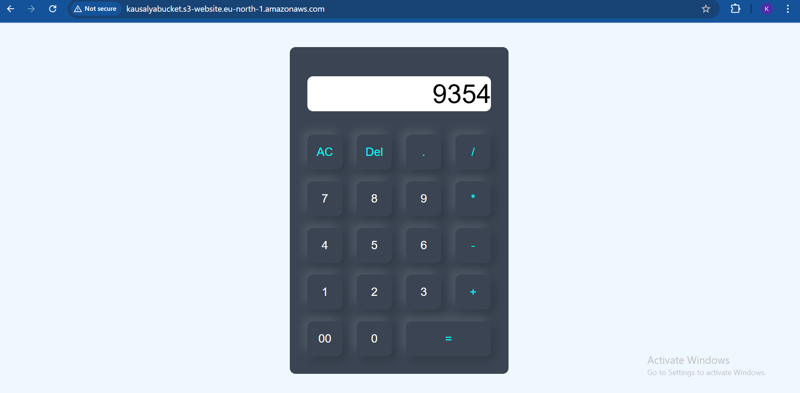

# Project-7: Serverless Website Hosting on AWS S3

## 📌 Overview

In this project, I hosted a **static website (calculator app)** on **Amazon S3** using its **serverless hosting** capabilities.  
The setup ensures high availability, durability, and a cost-effective solution to run a fully serverless web application without managing servers.

---

## 🏗️ Architecture Flow

1. **S3 Bucket Creation**

   - Created an S3 bucket named **`kausalyabucket`**.
   - Disabled all **block public access** settings.
   - Enabled **ACLs** to allow public object access.

2. **Static Website Hosting**

   - Uploaded my own static website files (**HTML, CSS, JavaScript**).
   - Enabled **Static Website Hosting** on the bucket.
   - Configured the index document (`index.html`) and error document.

3. **Access**
   - Website is accessible via the **S3 public endpoint**:
     ```
     http://kausalyabucket.s3-website.eu-north-1.amazonaws.com
     ```

---

## 🧪 Testing

- Accessed the website in a browser.
- Verified full functionality of the **calculator app** hosted on S3.

---

## 📸 Output


![Calculator App Hosted on S3]

---

## 🎯 Key Learnings

- How to host **static websites on S3**.
- Configuring **bucket policies, ACLs, and permissions** for public hosting.
- Basics of **serverless architecture** (no servers to manage, fully AWS-managed).

---
