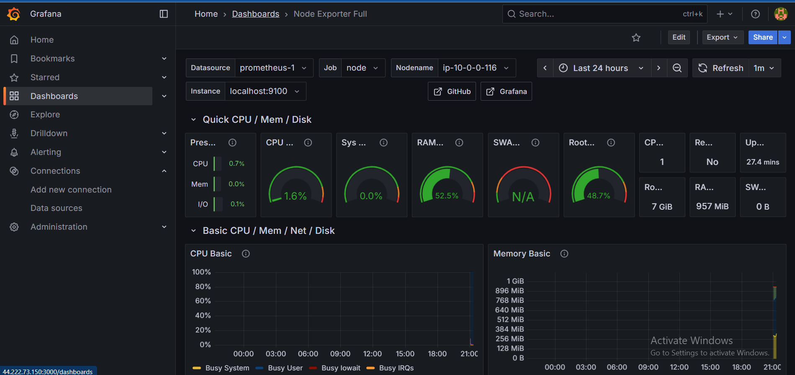

# Project-9 Monitoring EC2 with Prometheus & Grafana on AWS

This project demonstrates how to monitor an **EC2 instance** using **Prometheus** as a metrics collector and **Grafana** as a visualization tool.

I deployed both Prometheus and Grafana on an **Ubuntu EC2 instance**, configured metrics scraping, and exposed Grafana dashboards securely.

---

## 🔹 Architecture

1. **EC2 Instance** (Ubuntu 24.04 – Free Tier)
2. **Prometheus** – collects metrics (port `9090`)
3. **Grafana** – visualizes metrics via dashboards (port `3000`)

---

## 🔹 Setup Steps

### 1. Launch EC2

- AMI: Ubuntu 24.04 LTS
- Type: `t2.micro` (for demo; recommended `t3.small` or bigger for smoother Grafana)
- Open required ports (see **Security Groups** below).

### 2. Update & Install Prerequisites

```bash
sudo apt-get update
sudo apt-get install -y apt-transport-https software-properties-common wget

/*Grafana*/
# Add Grafana GPG key & repo
sudo mkdir -p /etc/apt/keyrings/
wget -q -O /etc/apt/keyrings/grafana.gpg https://apt.grafana.com/gpg.key
echo "deb [signed-by=/etc/apt/keyrings/grafana.gpg] https://apt.grafana.com stable main" | sudo tee /etc/apt/sources.list.d/grafana.list

# Install Grafana
sudo apt-get update
sudo apt-get install grafana -y

# Enable Grafana service
sudo systemctl enable grafana-server
sudo systemctl start grafana-server
/* Install Prometheus */
sudo apt-get install prometheus -y
systemctl enable prometheus
```

### 3. Access:

Access prometheus: http://<EC2-Public-IP>:9090
Access Grafana:
👉 http://<EC2-Public-IP>:3000/login

Default login:
Username: admin
Password: admin

4. Connect Prometheus to Grafana

Go to Grafana → Connections → Add data source.

Choose Prometheus.

URL: http://localhost:9090

Save & Test.

Import prebuilt EC2 monitoring dashboards(1860) or build custom panels.

🔹 Security Groups (Important!)
Bastion / SSH
Inbound:
Port 22 → Source: My IP
Outbound: Allow all

EC2 with Prometheus & Grafana
Inbound:
Port 22 (SSH) → Your IP
Port 9090 (Prometheus UI) → Your IP (or 0.0.0.0/0 for demo)
Port 3000 (Grafana UI) → Your IP (or 0.0.0.0/0 for demo)
Outbound: Allow all

⚠️ Tip: In production, never open Grafana/Prometheus to the whole internet (0.0.0.0/0). Restrict to your IP or use a VPN.

🔹 Output

Prometheus successfully scraped EC2 metrics.

Grafana displayed EC2 metrics (CPU, memory, network, etc.) in dashboard format.

Sample Grafana Dashboard:
👉 []
